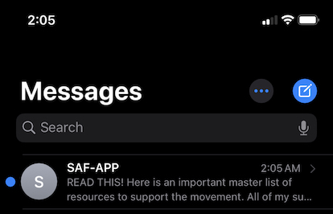

# Start a 🔥App (Client)
A platform to make causes more personal by utilizing SMS notifications and resource sharing. For activists, it's a platform to subscribe to causes and thought leaders they truly care about get inspired by. For thought leaders, it is a way to engage and activate more people for your cause. 

## Inspiration
This app is inspired by the consistent efforts of the vanguards on the front lines who are seeding the roots of activism in others in order to create lasting structural changes.

[Link to Site](https://saf-textapp-client.jml0123.vercel.app/)

Thought leaders have a dedicated subscription card and profile link they can share with everyone. 

Users can create and schedule messages on the dashboard to be sent to all their subscribers.

Messages are recieved by subscribers according to the scheduled time 

# Technology Used
- PostgreSQL
- Express.js
- Node.js (node-cron to schedule SMS message sending) 
- React.js
- (Twillio API)

Here's a 
[link](https://github.com/jml0123/saf-api) to the SAF API repo.
